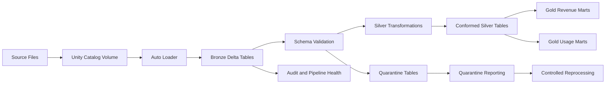

[](https://github.com/arcode35/meterlake/actions/workflows/ci.yml)

# MeterLake

MeterLake is a production-style Databricks lakehouse for processing SaaS usage, billing, pricing, subscription, and revenue data.

The project demonstrates how a usage-based software company can ingest operational events, enforce data contracts, isolate malformed records, build conformed business entities, and publish analytics-ready revenue metrics using PySpark, Delta Lake, Unity Catalog, and Databricks Asset Bundles.

## Overview

MeterLake implements a layered lakehouse architecture:

- **Bronze** preserves source records and ingestion metadata.
- **Silver** validates, standardizes, deduplicates, and conforms business entities.
- **Gold** publishes billing, revenue, subscription, and product-usage metrics.
- **Data quality** rules identify invalid records and route them to quarantine.
- **Operations** modules expose pipeline health, audit history, quarantine reporting, and reprocessing workflows.

The repository is structured as an installable Python package and deployed as a versioned wheel through Databricks Asset Bundles.

## Architecture



### Bronze layer

Bronze ingestion uses Databricks Auto Loader and Structured Streaming to incrementally process source files.

The ingestion layer is responsible for:

- Preserving source-system fidelity
- Recording ingestion timestamps and file metadata
- Maintaining independent schema and checkpoint locations
- Supporting configurable streaming triggers
- Rescuing unexpected fields for later inspection
- Writing append-oriented Delta tables

### Silver layer

Silver transformations convert raw records into validated and consistently typed business entities.

The Silver layer handles:

- Schema enforcement and safe type conversion
- Timestamp normalization
- Business-key validation
- Deterministic deduplication
- Standardized units and identifiers
- Record-level quality evaluation
- Separation of valid and quarantined records

Feed-specific transformation logic is registered through a central transformation registry, allowing the pipeline to dispatch processing by feed without embedding feed-specific branching in job entry points.

### Gold layer

Gold tables expose analytics-ready metrics for billing, finance, product, and customer reporting.

Current Gold models include:

- Account usage
- Customer revenue
- Invoice revenue
- Monthly recurring revenue movements
- Product usage metrics

## Data Sources

MeterLake processes eight logical source feeds:

| Feed                     | Description                                                                       |
| ------------------------ | --------------------------------------------------------------------------------- |
| `usage_events`           | Product consumption events such as requests, tokens, exports, storage, or minutes |
| `billing_events`         | Billable events and calculated charges                                            |
| `invoice_line_items`     | Invoice-level charges, quantities, and billing periods                            |
| `customers`              | Customer account and lifecycle attributes                                         |
| `customer_subscriptions` | Customer subscription state and effective periods                                 |
| `pricing_plans`          | Product plans, pricing models, and unit rates                                     |
| `plan_changes`           | Subscription upgrades, downgrades, activations, and cancellations                 |
| `commercial_adjustments` | Credits, discounts, corrections, and other billing adjustments                    |

Representative fixture data is available under [`fixtures/`](fixtures/) for local development and automated tests.

## Data Quality

Data quality checks are implemented as reusable rules rather than being embedded directly in individual transformations.

Examples include:

- Missing required identifiers
- Invalid or unparseable timestamps
- Negative usage quantities
- Unsupported usage units
- Invalid effective-date ranges
- Duplicate business events
- Referential inconsistencies between billing entities

Records that fail critical rules are written to quarantine instead of being silently discarded.

Operational modules support:

- Quarantine summaries
- Failure-reason reporting
- Pipeline-health inspection
- Processing audit logs
- Controlled quarantine reprocessing

See [`docs/data_quality.md`](docs/data_quality.md) for the complete quality strategy.

## Technology Stack

- Azure Databricks
- Apache Spark and PySpark
- Delta Lake
- Unity Catalog
- Databricks Auto Loader
- Structured Streaming
- Databricks Workflows
- Databricks Asset Bundles
- Python wheel packaging
- pytest

## Repository Structure

```text
meterlake/
├── databricks.yml              # Databricks Asset Bundle configuration
├── resources/jobs/             # Databricks job definitions
├── src/meterlake/
│   ├── bronze/                 # Incremental source ingestion
│   ├── silver/                 # Conformance and feed transformations
│   ├── gold/                   # Analytics-ready business models
│   ├── schemas/                # Bronze, Silver, and Gold schemas
│   ├── quality/                # Reusable data-quality rules
│   ├── streaming/              # Streaming trigger configuration
│   ├── observability/          # Application logging
│   ├── ops/                    # Audit, health, and quarantine operations
│   ├── config/                 # Environment and resource configuration
│   └── jobs/                   # Deployable job entry points
├── tests/                      # Unit and transformation tests
├── fixtures/                   # Representative source records
├── docs/                       # Architecture and operations documentation
├── notebooks/exploration/      # Interactive development notebooks
└── pyproject.toml              # Package and dependency configuration
```

## Deployment Model

MeterLake uses Databricks Asset Bundles to define infrastructure-aware jobs and deploy the packaged application consistently across environments.

The bundle contains three primary workflows:

| Workflow           | Purpose                                                  |
| ------------------ | -------------------------------------------------------- |
| `bronze_ingestion` | Incrementally ingest configured source feeds into Bronze |
| `quality_checks`   | Evaluate pipeline and table-level data quality           |
| `gold_refresh`     | Recompute analytics-ready Gold models                    |

Environment-specific catalog names, schemas, volume paths, checkpoints, and Auto Loader schema locations are resolved through centralized configuration.

## Prerequisites

Before deploying MeterLake, install:

- Python 3.12
- [`uv`](https://docs.astral.sh/uv/)
- Databricks CLI
- Access to an Azure Databricks workspace
- A Unity Catalog-enabled workspace
- Permission to create or use the required catalogs, schemas, volumes, and jobs

## Local Setup

Clone the repository and install its dependencies:

```bash
git clone <repository-url>
cd meterlake
uv sync
```

Activate the environment:

```bash
source .venv/bin/activate
```

Build the Python wheel:

```bash
uv build
```

The generated wheel will be written to `dist/`.

## Databricks Authentication

Authenticate the Databricks CLI:

```bash
databricks auth login
```

Confirm that the bundle is valid:

```bash
databricks bundle validate --target dev
```

## Deployment

Deploy the development target:

```bash
databricks bundle deploy --target dev
```

Run an individual workflow:

```bash
databricks bundle run --target dev bronze_ingestion
databricks bundle run --target dev quality_checks
databricks bundle run --target dev gold_refresh
```

Deploying to another environment uses the same bundle with a different target:

```bash
databricks bundle validate --target prod
databricks bundle deploy --target prod
```

Production deployment requires the corresponding catalogs, schemas, storage locations, and permissions to exist or be provisioned separately.

## Running Tests

Run the complete test suite:

```bash
uv run pytest
```

Run tests with verbose output:

```bash
uv run pytest -v
```

Run a specific test module:

```bash
uv run pytest tests/test_silver_dedup.py
```

The test suite covers areas including:

- Bronze ingestion behavior
- Job-parameter validation
- Resource-path generation
- Data-quality rules
- Silver deduplication
- Gold metric calculations

## Configuration

MeterLake centralizes configuration under `src/meterlake/config`.

Configuration includes:

- Environment validation
- Catalog and schema resolution
- Volume and checkpoint paths
- Auto Loader schema locations
- Supported feed names
- Streaming trigger behavior
- Databricks resource identifiers

Job entry points validate their parameters before starting Spark workloads so invalid environments, feeds, or trigger modes fail early.

## Documentation

Additional design and operational documentation is available under [`docs/`](docs/):

- [`architecture.md`](docs/architecture.md) — system components and data flow
- [`data_contracts.md`](docs/data_contracts.md) — source and table contracts
- [`data_quality.md`](docs/data_quality.md) — validation and quarantine strategy
- [`orchestration.md`](docs/orchestration.md) — workflow dependencies and execution
- [`operations_runbook.md`](docs/operations_runbook.md) — monitoring, recovery, and reprocessing

## Engineering Goals

MeterLake is designed to demonstrate:

- Modular PySpark application architecture
- Incremental and idempotent data processing
- Explicit data contracts
- Reusable data-quality enforcement
- Environment-independent configuration
- Governed storage with Unity Catalog
- Deployable Databricks jobs
- Automated transformation testing
- Operational visibility and recovery paths
- Separation between ingestion, transformation, analytics, and orchestration concerns

## Project Status

MeterLake is an engineering portfolio project intended to model the architecture and operating practices of a production SaaS metering and revenue platform.

The current implementation focuses on the end-to-end data platform: ingestion, conformance, quality management, analytical modeling, deployment, testing, and operational support.
